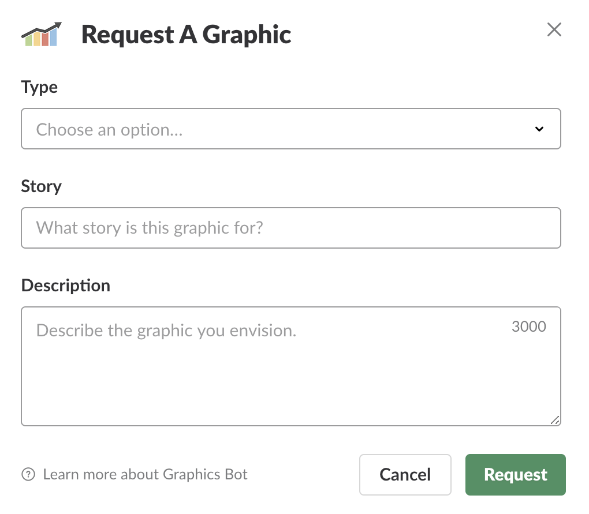
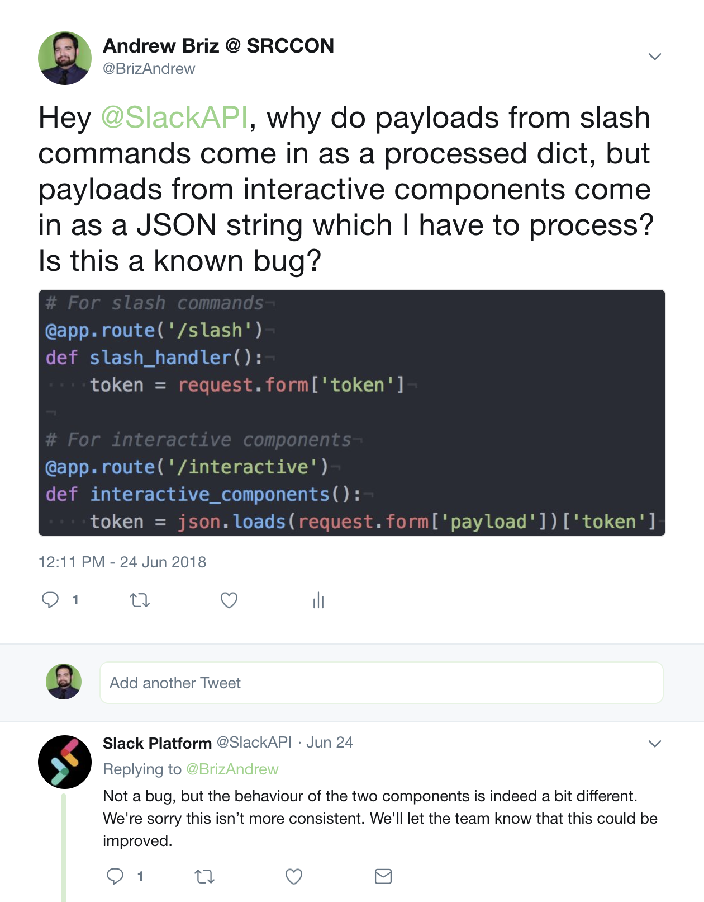
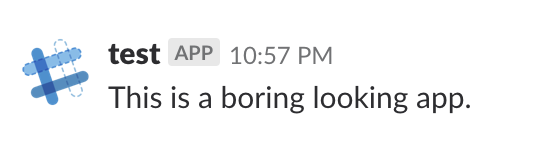

# Who Needs A Front End?
## How To Leave The UX of Newsroom Tools to Slack


### How do I get my app set up with Slack?
#### Slack API Setup

The first thing to set up is a new Slack App. Go to the [Slack API dashboard](https://api.slack.com/apps/) and select "Create New App". Give it a name and choose the right workspace. That's it for now.

#### Python Setup
You'll want to use the typical python setup to develop this app. I'll be using Flask in for this project since I won't be needing anything more than a simple web router.

Set up your virtual environment and activate it.

```bash
$ virtualenv graphics-request
$ cd graphics-request
$ source bin/activate
```

Next pip install `flask`, [`slackclient`](https://github.com/slackapi/python-slackclient), and [`slackeventsapi`](https://github.com/slackapi/python-slack-events-api). These are two libraries developed by Slack to help python developers interact with their APIs. You can find all kinds of other modules for other languages at their official [Slack API Github](https://github.com/slackapi) (don't confuse this one with their main company Github).

```bash
$ pip install flask, slackclient, slackeventsapi
```

Once you have `slacklient` installed you'll need to create a new instance of it using your App token (see [Difference Between Token Types](#difference-between-token-types) for more on getting this token). You should keep the token and the instantiation of this client in a separate file which can be imported. You can see this being doing in [info.py](app/info.py#L26).

_Note: Remember that in production tokens should always be kept somewhere secure like the environment variables_.


#### Ngrok
[Ngrok](https://ngrok.com/) is a tool used to tunnel requests from public URLs to your localhost development server and is useful for developing Slack apps. Most of the app's functionality will require some kind of webhook with a public URL, but that likely won't be available until the app is complete.

To get around this download Ngrok at the link above. It's a Unix executable file which means it can be run from the command line. In order to run it from any directory (on MacOS) move it to `/usr/local/bin` or wherever your operating system keeps its executable files.

Once there, you can run it with the following command which will tunnel a public URL to your localhost at port 5000.

```bash
$ ngrok http 5000
```
***

### What can I do with Slack's APIs?
#### Authorization
All POST requests from Slack come with a verification token to prove that the request truly is from them. This token can be found in the "Basic Information" tab of your Slack App Dashboard.

I normally create a separate verification function that I use for every route in my flask file. You can check out [the flask app file](app/app.py#L22-L29) to see that function in action.

#### Slash Commands
Slack uses slash commands as a form of function calls from within the app. Just like you'd call a function named `new_request` in your python code by adding parenthesis to the end with arguments, you can set up your app to call that same function by proceeding it with a `/` and including the argument after a space.

```python
new_request(arg) # Python function call
/new_request arg # Slack function call
```

_Note: Slack slash commands can only take one argument which is all the text written after the command in a string._

You'll need to set these up in your Slack App Dashboard as well. Each slash commands can have its own route, or you can give them all the same path and handle it in your route logic.

Go to your  dashboard and choose "Slash Commands" under "Features". Click "Create New Command". Fill out the form using your HTTPS ngrok URL + the slash command route as the "Request URL". The command is what users on Slack will type to run your function.

To see what the route logic looks for a slash command check out [the flask app file](app/app.py#L40-L56)

You can read more about Slash Commands on [the official documentation for it](https://api.slack.com/slash-commands).

#### Posting Basic Messages
Basic messages can be posted using the Web API. To make calls to it, use the your slack client and the `api_call` function (passing the name of the method as the first argument).

```python
sc_bot.api_call(
    "chat.postMessage",
    channel=channel_id,
    text="a message",
)
```

This will post a message with the text "a message" to the channel with a given `channel_id` (see [Finding Channel Ids](#finding-channel-ids) for more).

You can read more about Basic Messages on [the official documentation for it](https://api.slack.com/docs/messages).

#### Posting Complex Messages
Interactive messages contain more than just text though.

Slack apps have the capability to format messages in much cleaner ways than human users can by leveraging the power of attachments. These attachments can be images, links, other text, or even interactive components (see next section).

Let's take a look at what one of these messages look like.


And now let's take a look at the code for this message:
```javascript
{
    "text": "New comic book alert!",
    "attachments": [
        {
            "title": "The Further Adventures of Slackbot",
            "fields": [
                {
                    "title": "Volume",
                    "value": "1",
                    "short": true
                },
                {
                    "title": "Issue",
                    "value": "3",
                    "short": true
                }
            ],
            "author_name": "Stanford S. Strickland",
            "author_icon": "http://a.slack-edge.com/7f18https://a.slack-edge.com/bfaba/img/api/homepage_custom_integrations-2x.png",
            "image_url": "http://i.imgur.com/OJkaVOI.jpg?1"
        },
        {
            "title": "Synopsis",
            "text": "After @episod pushed exciting changes to a devious new branch back in Issue 1, Slackbot notifies @don about an unexpected deploy..."
        },
        {
            "fallback": "Would you recommend it to customers?",
            "title": "Would you recommend it to customers?",
            "callback_id": "comic_1234_xyz",
            "color": "#3AA3E3",
            "attachment_type": "default",
            "actions": [
                {
                    "name": "recommend",
                    "text": "Recommend",
                    "type": "button",
                    "value": "recommend"
                },
                {
                    "name": "no",
                    "text": "No",
                    "type": "button",
                    "value": "bad"
                }
            ]
        }
    ]
}
```

The first thing to notice is that the image above has four sections (divided by the gray lines to the left of each section). There are also four objects in attachments. That's not a coincidence. Generally you want to keep the number of attachments as low as possible.

You can read more about Complex Messages on [the official documentation for it](https://api.slack.com/docs/message-attachments).

#### Posting Interactive Messages

Finally, you can also give your messages some interactivity. These have to be set up in your app dashboard under the "Interactive Components" section. You'll need to provide an ngrok-based Request URL (for example if my ngrok URL is `https://be40a372.ngrok.io` and my interactive route is going to be `/slack` then I should put `https://be40a372.ngrok.io/slack` in "Request URL").

There are two types of interactions supported:
- Buttons
- Select Dropdowns

These interactibles are treated just like any other message attachments, and can be combined with them to make one complex interactive message posted with the same API call as a basic message. Check out [request_made.py](app/functions/request_made.py#L14-L56) for an example of this.

You'll notice each interactible has a callback_id you provide. That's important because all button presses and dropdown selections created by your app go to one route. These Ids tell you which button was pressed. See the route for the interactive dropdown menu created above in [the flask app file](app/app.py#L59-L90), specifically [these lines](app/app.py#L75-L80).

You can read more about Interactive Messages on [the official documentation for it](https://api.slack.com/interactive-messages).

#### Threading
Threading is just a one more step from basic messages. By passing on extra argument to the `api_call`, `thread_ts`, with the value of a valid `message_ts`, you can reply to another message rather than posting a whole new one. Check out [status_change.py](app/functions/status_change.py#L33-L43) to see this in action.

You can read more about Threading on [the official documentation for it](https://api.slack.com/docs/message-threading).


#### Other Web API Methods
You can do all kinds of stuff with the Web API methods. Some examples used in this app are pinning messages (which you can find in [status_change.py](app/functions/status_change.py#L53-L57)) or posting messages that only a specific user can see (which you can find in [request_made.py](app/functions/request_made.py#L66-L80)).

You can read more about other Web API methods on [the official documentation for it](https://api.slack.com/web).


#### Message Actions
Message Actions are another form of interactivity which share a lot in common with Interactive Messages (including the same Request URL). These are essentially commands that can be automatically called from any message via the context menu (`...`) and mapped to a function in your interactive handler.

To set them up navigate over to "Interactive Components" in your Slack App Dashboard and click "Create New Action". When your action is called by a user, a payload will be sent to your route with the `type` `message_action` and a `callback_id` you set up in the dashboard.

Check out [the flask app file](app/app.py#L82-L87) to see how to handle one of these.

You can read more about Message Actions on [the official documentation for it](https://api.slack.com/actions).


#### Dialog Submissions
Slack features a way for users of your Slack Workspace to fill out a form and have that information sent to an endpoint on your server. They call this feature **dialogs**.

Dialogs can take three kinds of input which share HTML equivalents:

Slack Type | HTML | Example Case
--- | --- | ---
text | `<input type="text" />` | A title
textarea | `<textarea></textarea>` | A longer description
select | `<select></select>` | A type

The first thing to know about dialogs is that they require a `trigger_id` in order to be called. This Id tells Slack which user to serve the dialog to and serves as spam protection. You cannot open a dialog without the user taking some sort of action to call for it.

In this app, when users call the Slash command `graphic`, they will be given this form to fill out:



Check out how this form was created in [new_request.py](app/functions/new_request.py). Just like actions, dialogs take a `callback_id` which you can reference in your route logic. Check out [the flask app file](app/app.py#L70-L73) for that.

You can read more about Dialog Submissions on [the official documentation for it](https://api.slack.com/dialogs).

#### Events
Events are like event listeners on regular webpages, but for Slack. Your app can receive a notification anytime something interesting happens (such as a new message being posted or a message being starred).

Slack's `slackeventsapi` library makes handling these events really easy. First set up the events you want to listen for in the Slack App Dashboard under "Event Subscriptions". You'll need to set up your route before you can start adding events.

Setting this up can be done in as simple as one line of code as you can see in [the flask app file](app/app.py#L15-L19) (or five lines if you want to keep them nice and short).

Once you have your route set up pass a combination of that route combined with your Ngrok URL into "Request URL" in the dashboard. Then, you can add workspace events to listen for.

Now, all that's left to do is map those individual events to functions of your own. That's also really easy with the use of a decorator. Check out [the flask app file](app/app.py#L92-L104) for this as well.

You can read more about Events and see all the different things to listen for on [the official documentation for it](https://api.slack.com/events-api#event_types).

***

### What are the things that cause hours of needless debugging?

#### Understanding Message Ids

Slack uses timestamps as a unique identifier for each message. Essentially the timestamps are so precise (or so the thinking goes) that no two messages will be sent (or processed) at the same time. In my experience this is true. You'll see this unique represented as `message_ts` in payloads.

#### Finding Channel Ids

Channel Ids are the most important piece of information that is also impossible to find. In most payloads you'll be able to find it either at the key of `channel_id` or at the key of `channel.id`. Unfortunately, when you get started you're not receiving payloads.

The easiest way to find it is to go to your Slack web interface (as in [`http://srccon2018frontend.slack.com/`](http://srccon2018frontend.slack.com/)) and navigate to a channel page. That should take you to a URL like `https://srccon2018frontend.slack.com/messages/CBCSRDZ1S/`. That last part (the `CBCSRDZ1S`) is the channel Id.


#### Inconsistent Payload Schemes & Documentation

Slack payloads...suck.

Take a look at the [example directory](app/examples) to see for yourself. Each type of interaction (every time you have to provide a separate Request URL), that payload arrives differently. The documentation is also often unclear as to what the full payload will look like. One of the payloads even come in as a serialized JSON string because... reasons I guess?

My general rule of thumb is that if you're unsure of what a payload looks like: just `print()` the whole thing so you can figure out the very complicated path to a particular `message_ts`.

I asked Slack about these inconsistencies on Twitter. Their answer?



#### Difference Between Token Types

Slack essentially has three tokens to worry about when creating internal apps:

- The Verification Token
- The App Token
- The Bot Token

As I said in the [Authorization](#authorization), the verification token is used to prove that incoming requests are actually coming from Slack. You can find this in your Slack App Dashboard under "Basic Information".

The App and Bot Tokens are essentially the same for the purposes of internal apps. You'll only see a Bot Token if you add a bot user to your app.

There are some others but I never use them. You can read up about them on [the official documentation](https://api.slack.com/docs/token-types).

#### Working With Collaborators

Developing by yourself is no fun. If you want to give other team members access to the Slack App Dashboard for your app, you can do that in "Collaborators". Collaborators will have full access to add functionality and change Request URLs.

#### Making The App Look Nice

Don't be this person...



Give your app some looks. At least steal an icon from the internet. To change the app's display name and icon, scroll down to "Display Information" in the "Basic Information" tab of the your Slack App Dashboard.

#### Providing Proper Feedback

Slack can do 90% of the tedious front-end work for you. One essential part of front-end design that it doesn't do though is proper user feedback: the concept that every action taken by a user should have a clearly visible outcome to tell the user that their action was registered from the system.

How to do this can vary from system to system and action to action, but some easy ways are sending them ephemeral messages (messages that only they can see) using the [`chat.postEphemeral`](https://api.slack.com/methods/chat.postEphemeral) Web API method.

Another key way to provide proper feedback with interactive messages is changing them someway. Maybe a button changes color from grey to green, or the selected option changes. You can do this using the [`chat.update`](https://api.slack.com/methods/chat.update) Web API method.

There's a whole host of other great advice from Slack on how to make your Slack Apps more usable and inviting to users in [the documentation](https://api.slack.com/best-practices).
